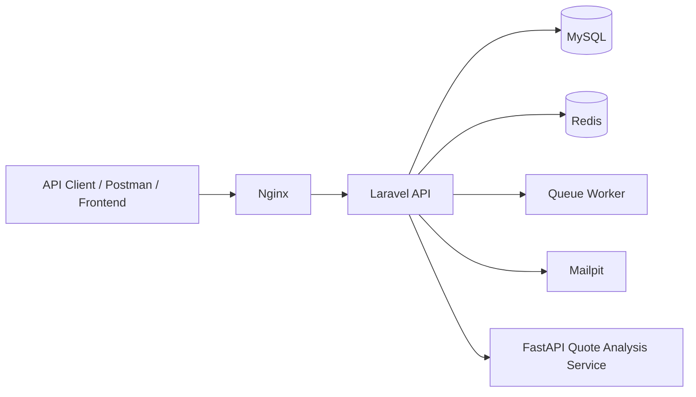
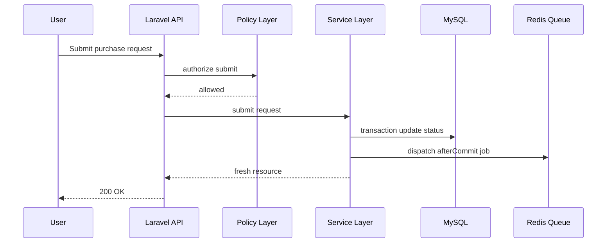
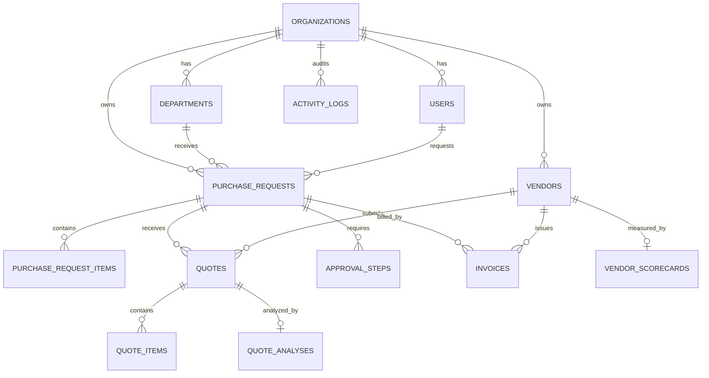

# ProcurePilot AI Architecture

ProcurePilot AI is a production-style Laravel SaaS backend for procurement workflows. It is designed around organization-level tenant isolation, role-based authorization, approval workflows, quote comparison, invoicing, auditability, and asynchronous operational jobs.

## High-level architecture

## Request lifecycle

## Domain model

## Design decisions

- Controllers stay thin and delegate business logic to service classes.
- Form Requests own validation and organization-scoped existence checks.
- Policies enforce authorization and prevent cross-tenant access.
- Services enforce business invariants such as invoice eligibility, approval sequencing, and tenant-safe lookup.
- Redis queue workers process asynchronous operational jobs.
- Activity logs provide auditability for important workflow decisions.
- Docker Compose runs the API, MySQL, Redis, Nginx, Mailpit, queue worker, and FastAPI sidecar locally.

## Production-readiness checklist

- Organization-scoped data model.
- Policy-based authorization.
- Feature tests for tenant isolation, authorization, billing, and health checks.
- CI pipeline for automated test execution.
- Health endpoint for dependency checks.
- Queue worker for asynchronous processing.
